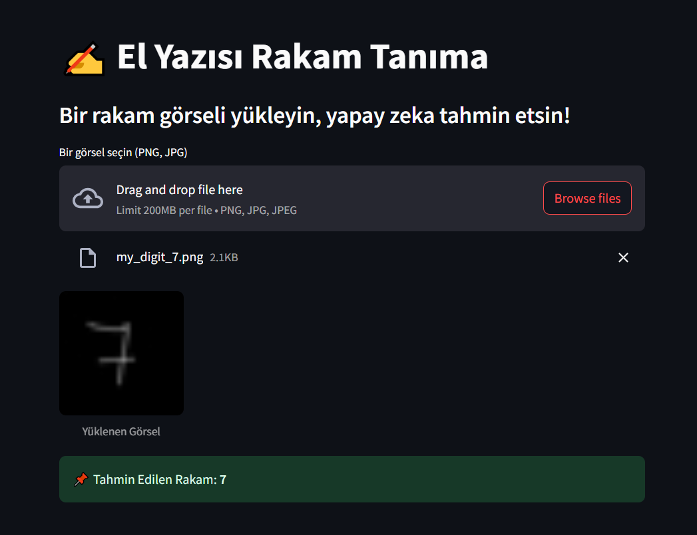
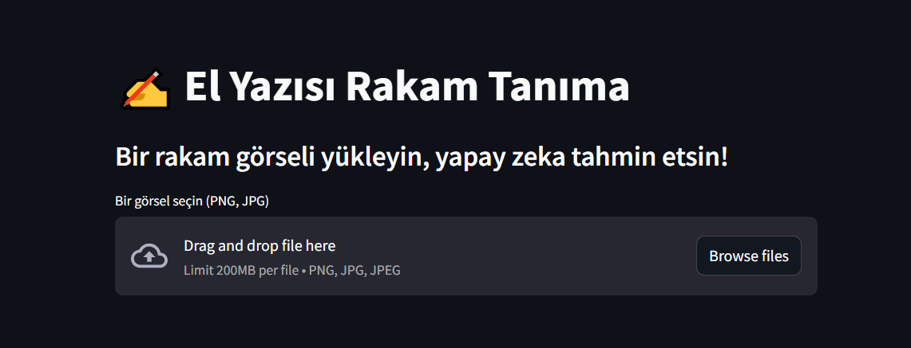

# ✍️ Handwriting Digit Recognition (MNIST) – v1.0

This project uses a Convolutional Neural Network (CNN) to recognize handwritten digits (0–9) using the MNIST dataset.  
The trained model is integrated into a simple Streamlit interface that allows users to upload digit images and get predictions instantly.

---

## ✅ Features

- 📥 Load and preprocess MNIST dataset
- 🧠 Build and train a CNN model (5 epochs)
- 📊 Evaluate model accuracy on test data
- 🔍 Visualize sample predictions
- 💾 Save model as `.h5`
- 🖼️ Upload your own digit image via web interface
- ⚡ Instant prediction using trained model

---

## 📸 Demo

### 📊 Model Training Result:

### 🖥️ Streamlit Interface:

---

## 🗂️ Project Structure

